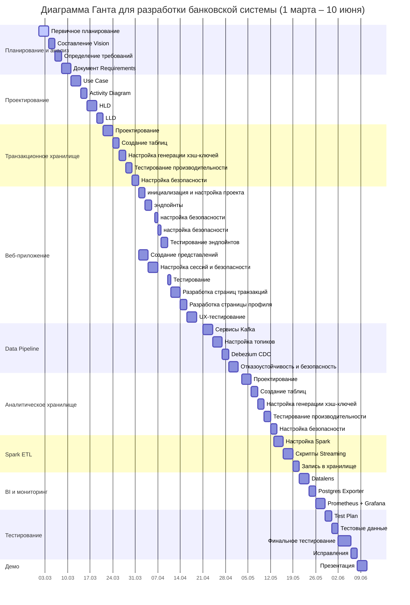

## Project summary:
Проект описывает полный жизненный цикл данных на примере data-pipeline финансовой организации: 
генерацию данных, поступление в хранилище, обработку, аналитику.

В него входят следующие компоненты: 
- веб-приложение финансовой организации (банк);
- транзакционное и аналитическое хранилища;
- ETL-процессы;
- BI-инструменты;
- инструменты мониторинга.

## Архитектура проекта

### Веб-приложение
- Backend на Django и Django-rest-framework;
- Frontend на Vue.js.

### Транзакционное хранилище
- Слой-источник (транзакционное хранилище) представлен в виде базы данных PostgreSQL;
- Данные нормализованы до 3NF (третья нормальная форма);
- Настроена логическая репликация;
- Установлены индексы;
- Произведен авто-тюнинг PostgreSQL в соответствии с выделяемыми на контейнер ресурсами;

### Аналитическое хранилище
- Слой представлен в виде базы данных PostgreSQL;
- Хранилище спроектировано по модели DataVault с некоторыми изменениями;
- STAGE слой для данных отсутствует, загрузка происходит сразу в основной слой;
- Установлены индексы;
- Произведен авто-тюнинг PostgreSQL в соответствии с выделяемыми на контейнер ресурсами;

### Брокер сообщений
- Apache Kafka для отслеживания изменений данных (CDC) в транзакционном хранилище;
- Debezium PostgreSQL Connector для CDC в транзакционном хранилище;
- KSQL для приведения данных к необходимому для DataVault формату (hub / sat / link);
- JDBC Sink Connector для загрузки данных из Kafka Stream топиков в аналитическое хранилище.

### Инструменты мониторинга
- Prometheus для сбора метрик работы сервисов: веб-приложения, транзакционного и аналитического хранилищ;
- Grafana для визуализации метрик.

### BI-инструменты
- Datalens on-premise для визуализации данных в интерактивных дашбордах.

